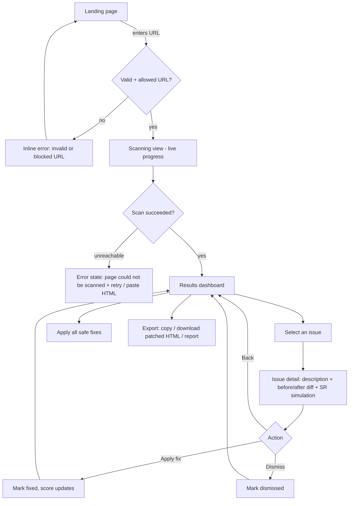
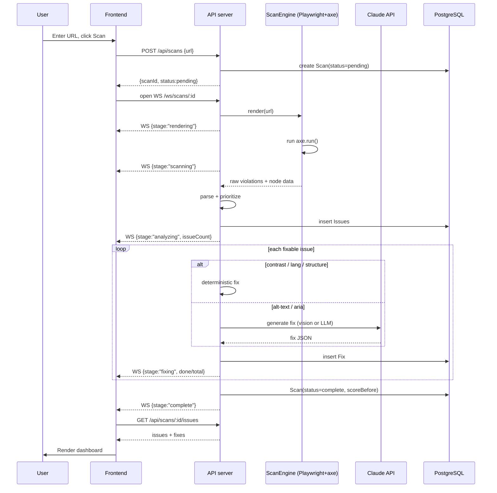
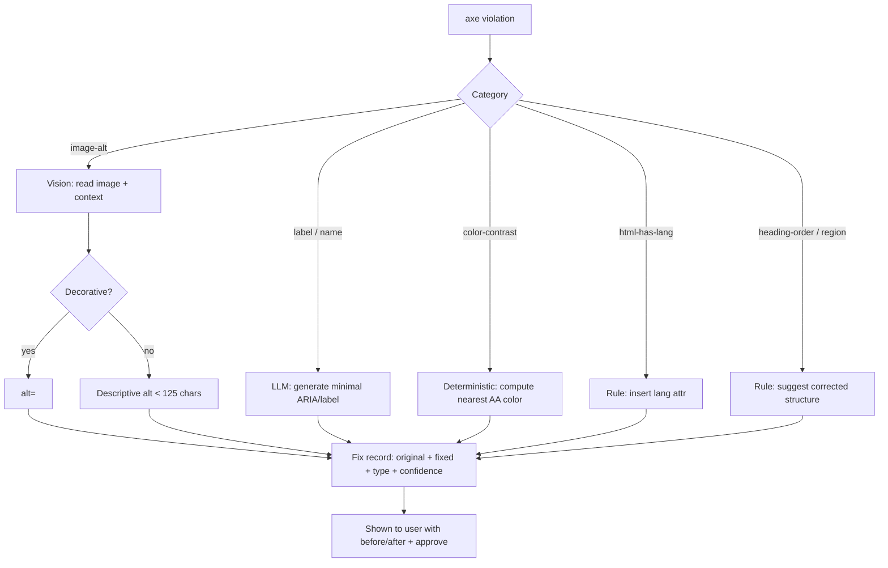
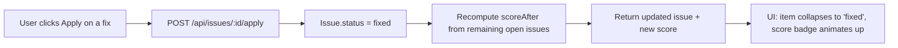
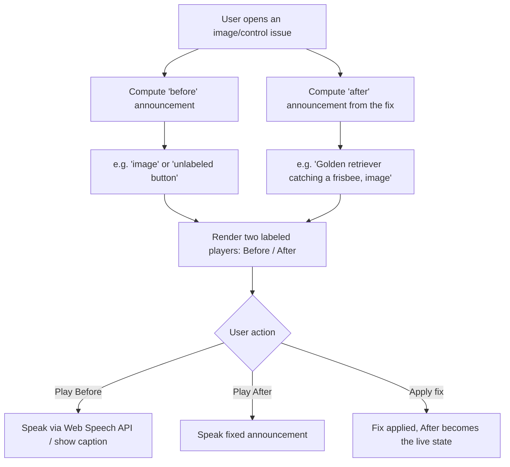

# 03 — App Flow

**Product:** AccessLens
Describes end-to-end user journeys, screen transitions, the scan/fix lifecycle, and edge cases. Diagrams use Mermaid (render on GitHub / most Markdown viewers; readable as text otherwise).

---

## 1. Top-level user journey



---

## 2. Screens & transitions

| Screen | Purpose | Enters from | Exits to |
|--------|---------|-------------|----------|
| **Landing** | URL input + value prop | app load | Scanning |
| **Scanning** | Live stage progress (render→scan→analyze→fix) | Landing | Results / Error |
| **Error** | Unreachable/blocked, with retry + paste-HTML | Scanning | Landing / Results |
| **Results dashboard** | Score + prioritized issue list + filters | Scanning | Issue detail / Export |
| **Issue detail** | One issue: context, diff, SR sim, actions | Results | Results |
| **Export** (modal/panel) | Copy fixes / download patched HTML / report | Results | Results |

---

## 3. Scan lifecycle (sequence)



---

## 4. Fix generation decision flow



> Contrast/lang/structure are instant (no network). Only alt-text and ARIA hit the AI — keeps the scan fast and the AI spend low.

---

## 5. Apply-fix flow



The corrected code is also added to the "patched HTML" export set, so applied fixes accumulate into the final downloadable output.

---

## 6. Screen-reader simulation flow (demo centerpiece)



Implementation note: the "announcement" is derived from accessible-name computation (alt text, label, role). Use the browser **Web Speech API** (`speechSynthesis`) for audio, and always show a text caption too (so it works muted / on any device, and is itself accessible).

---

## 7. Edge cases & error states

| Case | Behavior |
|------|----------|
| Invalid URL format | Inline validation on Landing; don't submit |
| Blocked URL (localhost/private IP) | Reject with clear message (SSRF guard) — never scan |
| Page unreachable / timeout | Error state with Retry + "paste HTML instead" (P1) |
| Page has **zero** violations | Celebrate: "No detectable issues 🎉" + note automated tools catch ~30–50% of WCAG, recommend manual testing |
| Image can't be fetched for vision | Fall back to context-based alt guess, flag low confidence |
| AI returns invalid JSON | Retry once → else rule-based placeholder fix, flagged "needs review" |
| Very large page (100s of issues) | Cap fix generation to top N by priority in MVP; list all detected, fix the important ones |
| User applies then wants to undo | Toggle back to open; recompute score |
| Network drops mid-scan | WS reconnect; if job done, fetch results; else show retry |

---

## 8. State model (frontend)

```
appState:
  view: 'landing' | 'scanning' | 'error' | 'results'
  scan: { id, url, status, stage, scoreBefore, scoreAfter, pageTitle } | null
  issues: Issue[]           // each with its Fix
  filters: { severity?, category?, status? }
  selectedIssueId: string | null
```

Transitions are driven by WS `stage` events during scanning and by REST responses for actions. Keep it in a single store (Zustand) so the score badge, list, and detail stay in sync.
