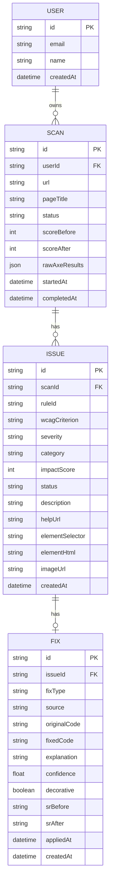

# 05 — Database

**Product:** AccessLens
**Engine:** PostgreSQL (SQLite acceptable for a pure-hackathon build — Prisma supports both)
**ORM:** Prisma

---

## 1. Entity overview



- **User** is optional in MVP (scans can be anonymous — make `userId` nullable). Included so multi-user/history is a small step later.
- **Scan 1—* Issue**, **Issue 1—1 Fix** (one primary fix per issue; model as 1—* if you later want alternative fixes).

---

## 2. Prisma schema

```prisma
// schema.prisma
generator client {
  provider = "prisma-client-js"
}

datasource db {
  provider = "postgresql"        // or "sqlite" for local hackathon
  url      = env("DATABASE_URL")
}

model User {
  id        String   @id @default(cuid())
  email     String   @unique
  name      String?
  scans     Scan[]
  createdAt DateTime @default(now())
}

model Scan {
  id            String    @id @default(cuid())
  user          User?     @relation(fields: [userId], references: [id])
  userId        String?
  url           String
  pageTitle     String?
  status        ScanStatus @default(pending)
  scoreBefore   Int?
  scoreAfter    Int?
  rawAxeResults Json?                     // full axe output for debugging/export
  issues        Issue[]
  startedAt     DateTime  @default(now())
  completedAt   DateTime?

  @@index([userId])
  @@index([status])
  @@index([startedAt])
}

model Issue {
  id              String      @id @default(cuid())
  scan            Scan        @relation(fields: [scanId], references: [id], onDelete: Cascade)
  scanId          String
  ruleId          String                       // axe rule id, e.g. "image-alt"
  wcagCriterion   String                       // e.g. "1.1.1 Non-text Content"
  severity        Severity
  category        FixCategory
  impactScore     Int         @default(0)      // priority = severity x impact x occurrences
  status          IssueStatus @default(detected)
  description     String
  helpUrl         String?
  elementSelector String                       // CSS selector to locate element
  elementHtml     String                       // outerHTML snapshot at scan time
  imageUrl        String?                       // resolved src for image issues (vision input)
  fix             Fix?
  createdAt       DateTime    @default(now())

  @@index([scanId])
  @@index([scanId, status])
  @@index([category])
}

model Fix {
  id           String     @id @default(cuid())
  issue        Issue      @relation(fields: [issueId], references: [id], onDelete: Cascade)
  issueId      String     @unique               // 1—1 with Issue
  fixType      FixCategory
  source       FixSource                          // ai-vision | ai-llm | deterministic
  originalCode String
  fixedCode    String
  explanation  String?
  confidence   Float?                             // 0..1 for AI fixes; null for deterministic
  decorative   Boolean    @default(false)         // for images marked decorative (alt="")
  srBefore     String?                            // screen-reader announcement before
  srAfter      String?                            // screen-reader announcement after
  appliedAt    DateTime?                          // set when user applies the fix
  createdAt    DateTime   @default(now())
}

enum ScanStatus {
  pending
  rendering
  scanning
  analyzing
  fixing
  complete
  failed
}

enum Severity {
  critical
  serious
  moderate
  minor
}

enum FixCategory {
  alt_text     @map("alt-text")
  aria_label   @map("aria-label")
  contrast
  structure
  lang
  other
}

enum IssueStatus {
  detected
  fixed
  dismissed
}

enum FixSource {
  ai_vision      @map("ai-vision")
  ai_llm         @map("ai-llm")
  deterministic
}
```

> **SQLite note:** SQLite doesn't support native enums or `Json` the same way. For a pure-SQLite hackathon build, change enums to `String` and `Json` to `String` (store JSON as text). Postgres is recommended if you're deploying.

---

## 3. Indexes & rationale

| Index | Why |
|-------|-----|
| `Scan(status)` | Poll/filter in-progress vs complete scans |
| `Scan(startedAt)` | Recent scans list / history ordering |
| `Issue(scanId)` | Load all issues for a scan (hot path) |
| `Issue(scanId, status)` | Recompute score from open issues; filtered lists |
| `Issue(category)` | Filter by fix type in the dashboard |
| `Fix.issueId @unique` | Enforce 1—1 and fast join |

---

## 4. Score computation

`scoreBefore` / `scoreAfter` are derived, stored for convenience (avoids recompute on every read).

Suggested formula (0–100, higher = more accessible):
```
penalty = Σ over OPEN issues of severityWeight
severityWeight: critical=10, serious=6, moderate=3, minor=1
score = max(0, 100 - penalty)   // optionally normalize by page size / element count
```
- `scoreBefore` computed when scan completes (all issues open).
- `scoreAfter` recomputed on each apply/dismiss/reopen (only `detected` issues count as penalties; `fixed` and `dismissed` are removed from penalty).

> Keep the exact weights in one constants file so the number is explainable in the demo ("critical issues cost 10 points each").

---

## 5. Lifecycle & retention

- On `POST /api/scans`: insert `Scan(status=pending)`.
- During job: update `status` per stage; bulk-insert `Issue` rows; insert `Fix` per issue.
- On complete: set `scoreBefore`, `completedAt`, `status=complete`.
- `rawAxeResults` stored for export/debugging — for privacy you may null it out after N days, or skip storing it and keep only parsed issues.
- **Cascade deletes:** deleting a Scan removes its Issues and their Fixes (`onDelete: Cascade`).

---

## 6. Seed / demo data

Ship a `seed.ts` that inserts one **pre-scanned demo Scan** (a known page) with realistic issues + generated fixes + SR strings. This guarantees a working dashboard on stage even with no network, and gives a stable target for the demo. Clearly mark it (e.g. `url = "demo://sample-site"` or a `pageTitle` of "Sample site (demo)") so it's never confused with a live scan.

---

## 7. Migrations

```bash
npx prisma migrate dev --name init        # create + apply initial migration
npx prisma generate                       # regenerate client after schema changes
npx prisma studio                         # inspect data during development
```
